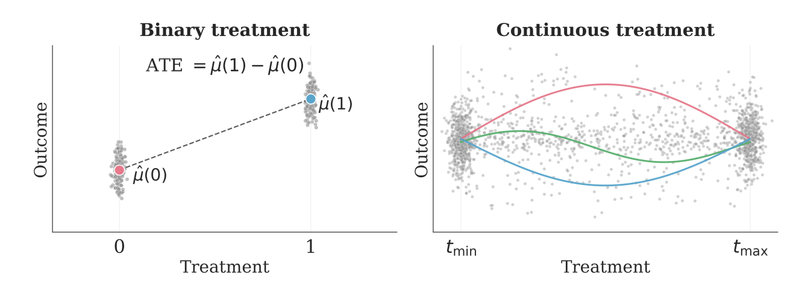
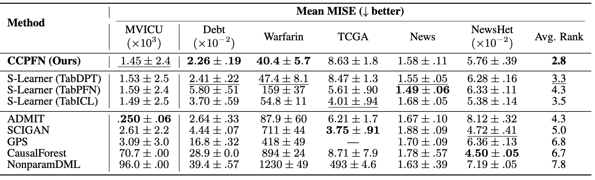
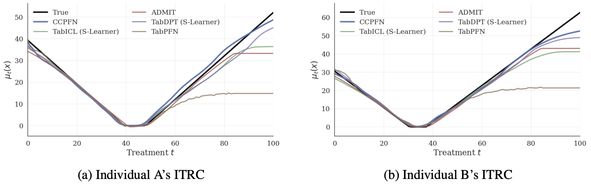

<div align="center">

# Causal Foundation Models with Continuous Treatments 

[](https://arxiv.org/abs/2605.15133)
[](https://huggingface.co/Layer6/CCPFN)
[](https://pypi.org/project/ccpfn/)

</div>

This is the repository for inference with CCPFN (**C**ontinuous **C**ausal **P**rior-**F**itted **N**etwork), a causal foundation model for use in domains with a continuous treatment variable. This setting often requires the estimation of a full treatment-response curve, a non-trivial task as illustrated in Figure 1. Observational (historic) data is supplied as context, and queries are passed at inference time. No further training is required. This is the inference repository; the full research reposistory (including training code and our prior) is forthcoming.


*Figure 1*:  Estimating causal effects for continuous treatments (right) is much more challenging than
for binary treatments (left), as multiple treatment-response curves fit the observed data equally well.

## Quick Start

Install with `pip`: 

```bash
pip install ccpfn
```

Model weights are available on [Hugging Face](https://huggingface.co/Layer6/CCPFN) and will be automatically downloaded on first use.

To install from source, ensure you have Python ≥3.10. Then run the following:
```bash
git clone https://github.com/layer6ai-labs/CCPFN-inference.git
cd CCPFN-inference
pip install -e .
```

Example notebooks on CCPFN usage, including individual treatment-response curve reconstruction tasks, can be found in the `notebooks` directory.

## Overview

CCPFN uses in-context learning (ICL) to estimate the effects of a continuously-varying treatment (for example, the dosage of a medication, or the sensitivity of economic outcomes to prices or rates). Specifically, it estimates the *conditional expected potential outcome* (CEPO), defined as $𝔼[Y(t) \mid X = x]$. 

Our model achieves state-of-the-art performance
on individual treatment-response curve reconstruction tasks compared to causal
models which are trained specifically for those tasks.


 *Table 1*: Comparative evaluation of mean MISE across benchmark test datasets. Columns correspond
to different benchmark datasets; values represent mean MISE ± standard deviation as computed
with 5-fold cross-validation. First place is bold, second place is underlined. Dashes (—) indicate no
meaningful results were obtained. When evaluating TabPFN we apply PCA to reduce the dimension
to 100, due to memory constraints and to match the dimensionality reduction used in CCPFN. DRNet,
VCNet, and EBCT did not produce meaningful results for the MISE metric and hence are omitted.



 *Figure 2*:  Predicted individual treatment-response curves (ITRCs) and true ITRC for two randomly selected individuals from the Warfarin benchmark, where the outcome represents the loss between a patient’s administered dose and the optimal dose, as determined by the IWPC pharmacogenetic dosing algorithm.

 # Citation

 ```@misc{stith2026causalfoundationmodelscontinuous,
      title={Causal Foundation Models with Continuous Treatments}, 
      author={Christopher Stith and Medha Barath and Vahid Balazadeh and Jesse C. Cresswell and Rahul G. Krishnan},
      year={2026},
      eprint={2605.15133},
      archivePrefix={arXiv},
      primaryClass={cs.LG},
      url={https://arxiv.org/abs/2605.15133}, 
}
```
